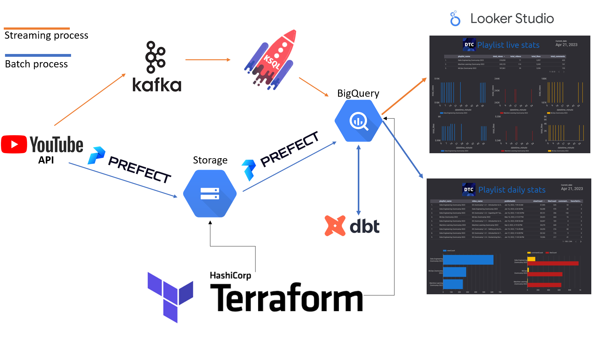

# Data Engineering Project: DataTalks Club overview Youtube playlist 

## DataTalksClub Data Engineering Course 2023

## About the project
Link to the dashboard: https://lookerstudio.google.com/s/mRI3MW97ePw
(note that I may have not updated the daily or have up and running the live view for cost reasons :) )

The project’s goal is to show stats regarding YouTube playlists. Specifically, we choose the playlist of DataTalksClub courses. 
We show daily information through a Batch pipeline and live changes in a Stream pipeline. 

**Batch process:** Takes daily general information (video name, description, video publication date, likes, views etc) about the playlist from the YouTube API. This is schedule with Prefect. First, it cleans and saves the information in google storage, then it transforms and saves the information/dataset in big query. After prefect, dbt takes the table and performs additional (modelled) transformations. Finally, Through a dbt deployment environment, we it schedule it to daily give the information to Bigquery table that is connected to Locker Studio.

**Stream process:** Takes every minute accumulated information (total views, total comments, total likes) from each playlist from the YouTube API and sends it to Kafka. In Kafka we detect changes in these values through KSQL and append every change in a Bigquery table. The Bigquery table is also connected to Locker Studio.

## Requirements

To run the project, you will need:

* Python ~ 3.9 (specifically the project was builded on `Python 3.9.16`)  

* Google cloud account with a project and a file (json usually) with the granted IAM roles (bigquery and gcp)

* Terraform Installation

* DBT cloud account

* Confluent Kafka cloud account

* Patience 

See the next section for more details.

## Instalation and set-up

### Python:

Download and install conda's python version ~ `Python 3.9.16`. Create and environment and run `pip install requirements.txt`.

### Batch process:

To run `/Batch_processing/youtube_watcher.py` in stream process you will need a `/Batch_processing/batch_config.py` file. 

The template is the following:
```python
config = {"google_api_key": "[Your google API key]",
    "youtube_playlist_id": "PL3MmuxUbc_hJed7dXYoJw8DoCuVHhGEQb",
```  

* `google_api_key`: [Document on how to get a google api key](https://developers.google.com/maps/documentation/javascript/get-api-key)

* youtube_playlist_id: the playlist id that is in the YouTube playlist we are interested. This one is the Data Engineering zoomcamp 2023. However, in the current version this field is no longer being used. So, you can keep it the same.

Prefect requires gcp storage and google credentials blocks active. You can follow these tutorials: [Tutorial on how to activate a gcp storage and gcp credential block](https://www.youtube.com/watch?v=W-rMz_2GwqQ&list=PL3MmuxUbc_hJed7dXYoJw8DoCuVHhGEQb&index=21&t=1000s)
[Tutorial on how to edit the scripts to connect to bigquery ](https://www.youtube.com/watch?v=Cx5jt-V5sgE&list=PL3MmuxUbc_hJed7dXYoJw8DoCuVHhGEQb&index=21)

### Stream process:

* Streaming and batch config:

To run `/Stream_processing/youtube_watcher.py` in stream process you will need a `/Stream_processing/config.py` file. 

The template is the following:
```python
config = {"google_api_key": "[Your google API]",
    "youtube_playlist_id": "PL3MmuxUbc_hJed7dXYoJw8DoCuVHhGEQb",
    "kafka":{
            "bootstrap.servers":"[Your kafka-bootstrap-server]",
            "security.protocol":"[Your security protocol]",
            "sasl.mechanism": "PLAIN",
            "sasl.username":"[your kafka API username]",
            "sasl.password":"[your kafka API secret]",


    },
    "schema_registry": {
        "url": "[Your registery url]",
        "basic.auth.user.info": "[registery username]/[registery secret]",
    }
```

A full tutorial to fill the config file is in: [How to fill config for stream](https://www.youtube.com/watch?v=jItIQ-UvFI4&t=0s)

* Spoiler alert!:

You will have to create a confulent kafka account https://confluent.cloud/login . There you will need to create a new enviroment and set up a connector with bigquery. [Setting up bigquery connector in kafka confluent](https://docs.confluent.io/cloud/current/connectors/cc-gcp-bigquery-sink.html#gcp-credentials)

## Running the pipeline

### Terraform (In case storage and bigquery are not activated)
```bash
cd terraform/
terraform init #optional if you have already ran it.
terraform plan #optional if you have already ran it.
terraform apply
```

### Batch pipeline

Assuming you set-up your python environment and satisfied the requirements in Installation and set-up section. You can run the Batch process manually or create a scheduled run with prefect deployment.

* Manually:
```bash
cd Batch_processing/
python etl_web_to_gcs.py
python etl_gcs_to_bq.py
```
* Scheduled:
Using Prefect deploy

Then you will need to got your dbt cloud and run. [Prefect tutorial: Parameterizing flows and Deployments](https://www.youtube.com/watch?v=QrDxPjX10iw&list=PL3MmuxUbc_hJed7dXYoJw8DoCuVHhGEQb&index=22)
* Manually:
```dbt
dbt test
dbt run
```
* Scheduled:
Otherwise you can also set up a daily scheduler in dbt by a deployment environment to run the commands above. [Tutorial: DBT project deloyment](https://www.youtube.com/watch?v=rjf6yZNGX8I&list=PL3MmuxUbc_hJed7dXYoJw8DoCuVHhGEQb&index=37)

### Stream pipeline
Assuming you set-up your python environment and satisfied the requirements in Installation and set-up section regarding Kafka account, credentials and biquery.

```bash
cd Stream_processing/
python youtube_watcher.py
```


### Improvements
Where do I even begin..

* Position column fix from youtube API (right now the video position column is one value that needs to be corrected)
* Save playlist ids in a config. (right now the id of the playlists are stored in the .py files, so if you want to add your own id you have to edit the scripts)
* Dashboard live view graph improvements. (The most important update will be the live view for each minute)

